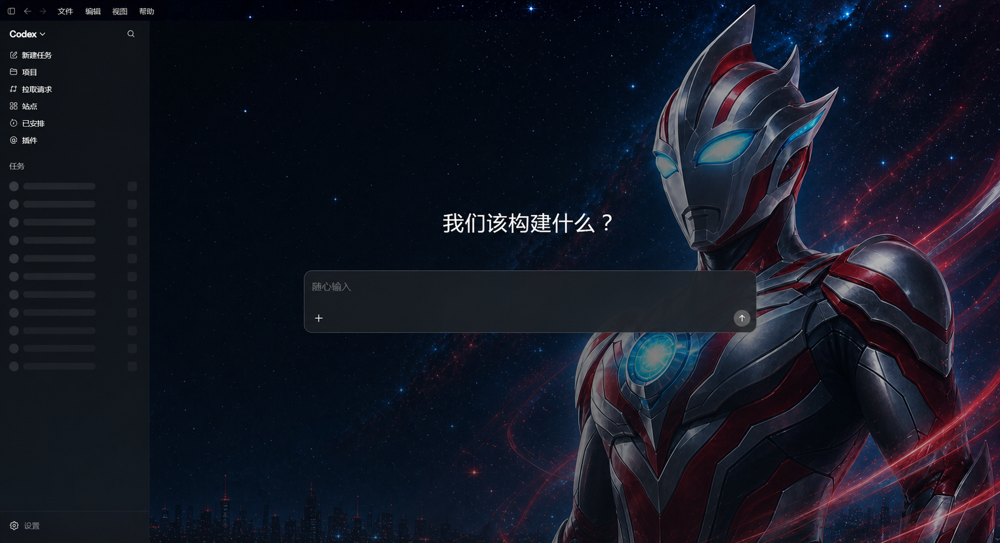

# Codex 奥特曼风 · 星穹守望

一套面向 Windows 版 Codex 的非官方主题包。它把原创红银“光之巨人”、深空星云和青色能量光效融入 Codex，同时保留输入区、侧栏与文字的可读性。

> 基于 [Fei-Away/Codex-Dream-Skin](https://github.com/Fei-Away/Codex-Dream-Skin) 制作。与奥特曼版权方、OpenAI 或 Codex 无官方关联。

## 实际运行效果



上图基于真实 Codex 运行界面制作，仅清除了任务历史、用户名和对话内容等私人信息。主题布局、整窗背景、侧栏层次和输入框效果均按实际运行状态展示。

## 启动器图标

<p align="center">
  
</p>

主题包内提供带独立图标的无控制台启动器：

```text
launcher\Codex 奥特曼主题.exe
```

启动时不会弹出 CMD 黑框。第一次运行会安装主题并打开 Codex；以后继续双击同一个 EXE 即可启动奥特曼主题。

## 下载与安装

### 第一步：下载

前往 [Releases](https://github.com/ElonFHaiTao/codex-ultraman-dream-skin/releases/latest)，下载：

```text
codex-ultra-light-skin.zip
```

同时提供 `.sha256` 文件用于校验下载完整性。

### 第二步：完整解压

不要直接在压缩包预览窗口里运行。请把 ZIP 完整解压到一个固定目录，例如：

```text
D:\Apps\Codex-Ultraman-Skin
```

启动器需要和 `windows` 文件夹保持原有相对位置。

### 第三步：运行 EXE

保存工作并完全退出正在运行的 Codex，然后双击：

```text
launcher\Codex 奥特曼主题.exe
```

启动器会自动完成：

1. 检查 Microsoft Store 版 Codex 和可用 Node.js 运行时。
2. 将主题安装到 `%LOCALAPPDATA%\CodexDreamSkin`。
3. 应用星穹主题、背景图和界面样式。
4. 启动带主题的 Codex。
5. 把执行日志保存到 `%LOCALAPPDATA%\CodexDreamSkin\one-click.log`。

## 视觉特性

- 2560 × 1440 原创星空壁纸，人物位于右侧，左侧保留导航和文字安全区。
- 背景贯穿标题栏、侧栏和主内容区，避免重复裁切。
- 首页和任务页根据内容自动调整背景遮罩强度。
- 输入光标使用纯白高对比色，聚焦时显示青色双层边框。
- 发送按钮使用青色高亮，启用与禁用状态都保持清晰。
- 原生建议卡片保持可见，不会被主题固定高度或溢出规则裁掉。
- 不修改 Codex 的 `app.asar`、WindowsApps 文件、官方签名、账号或 API 配置。

## 原始壁纸


壁纸是主题素材；上方“实际运行效果”才是它进入 Codex 后的界面表现。

## 系统要求

- Windows 10 或 Windows 11
- Microsoft Store 版 Codex
- PowerShell 5.1 或更高版本
- 默认优先使用 Codex 自带的 Node.js；无法找到时需要 Node.js 22 或更高版本

## 验证主题

需要排查安装状态时，在主题目录打开 PowerShell，运行：

```powershell
powershell -NoProfile -ExecutionPolicy Bypass -File .\windows\scripts\verify-dream-skin.ps1
```

详细日志位于：

```text
%LOCALAPPDATA%\CodexDreamSkin
```

## 恢复官方外观

在主题目录打开 PowerShell，运行：

```powershell
powershell -NoProfile -ExecutionPolicy Bypass -File .\windows\scripts\restore-dream-skin.ps1 -RestoreBaseTheme -PromptRestart
```

恢复过程会移除主题注入状态并还原安装前保存的 Codex 外观配置。

## 目录说明

```text
launcher/
  Codex 奥特曼主题.exe       无黑框图形启动器
  CodexUltraLightLauncher.cs 启动器源码
windows/
  assets/                    壁纸、主题配置与渲染样式
  scripts/                   安装、启动、验证与恢复脚本
  tests/                     注入和元数据测试
docs/images/                 README 展示图片
手动安装说明.md              故障排查和命令行说明
```

## 安全与隐私

- 注入调试端口只绑定 `127.0.0.1`，不会暴露到局域网。
- 图片分析和主题注入均在本机完成，不上传壁纸、任务内容或账号信息。
- 启动器源码包含在仓库中，可自行审阅或重新编译。
- 下载后可使用 Release 附带的 SHA-256 文件验证 ZIP。

## 许可与声明

- 引擎代码沿用上游 MIT 许可。
- 壁纸和图标为本项目使用的原创生成素材。
- “奥特曼风”仅描述红银光之巨人题材和视觉灵感；本项目不包含官方角色图、商标或授权内容。
